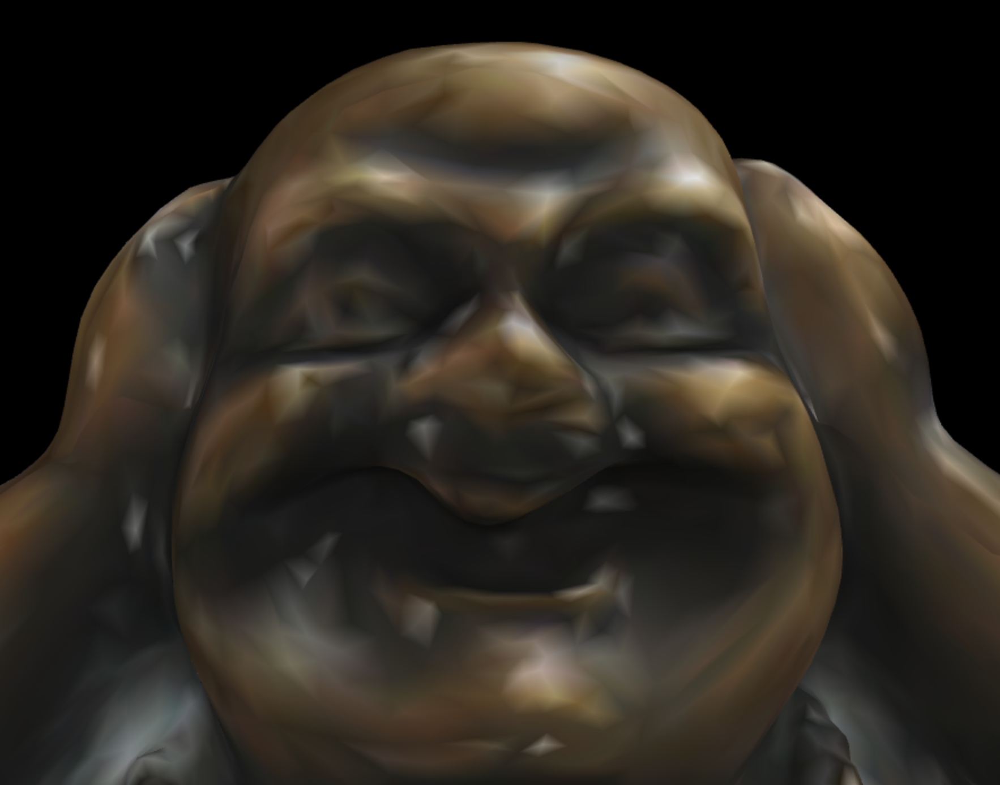
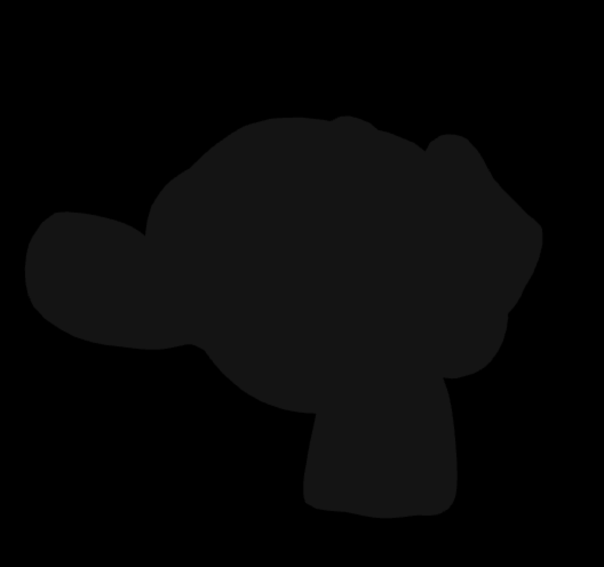
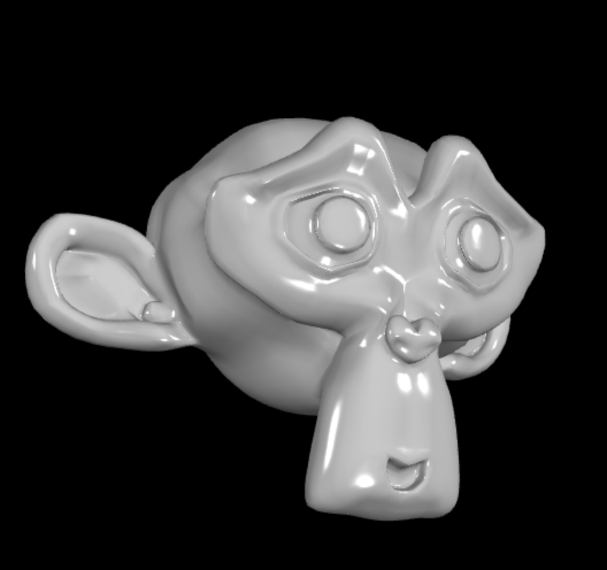
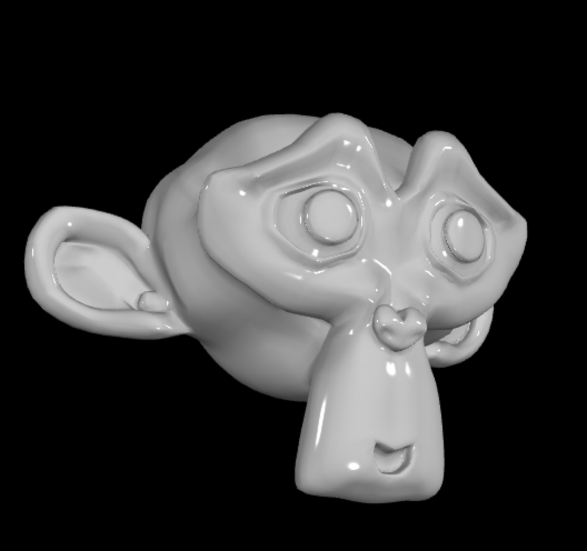
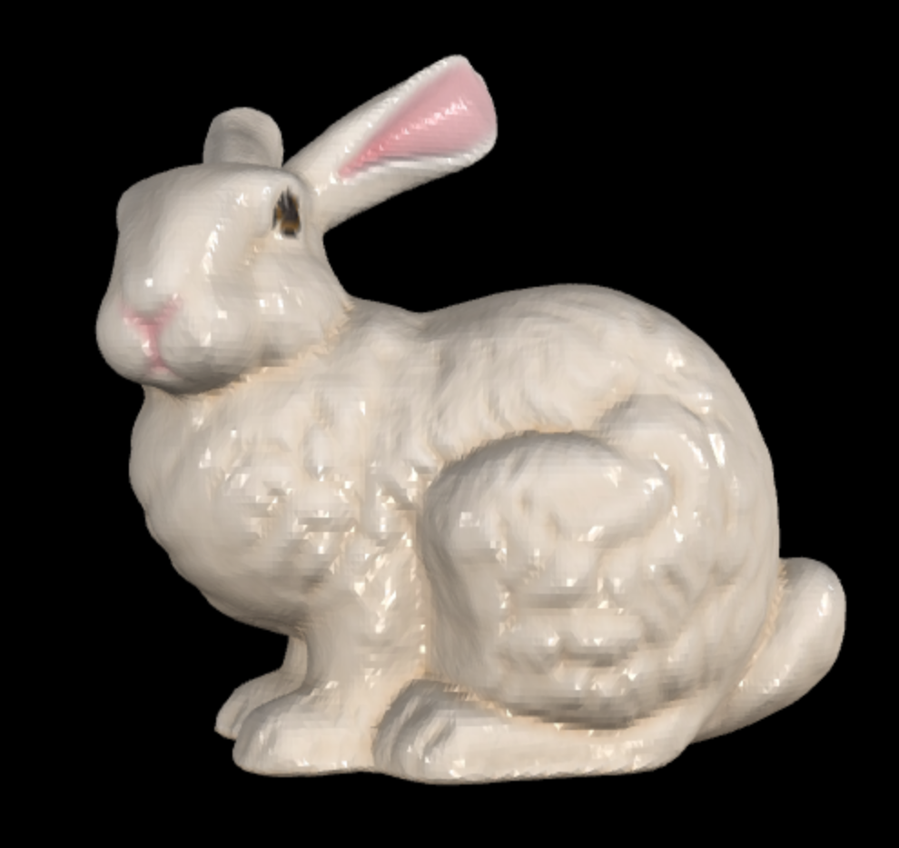
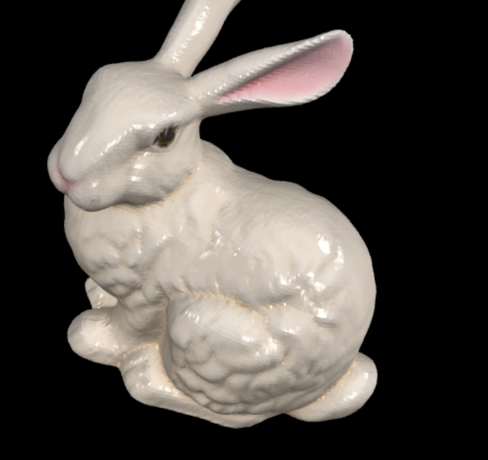
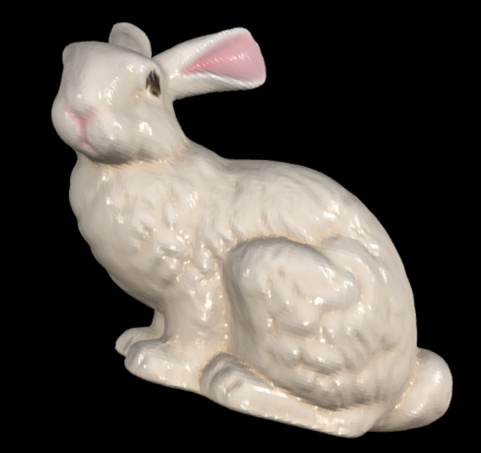

# 3D Viewer

3D viewer in WebGL and pure Javascript.

## Features
- Controllable Phong illumination model:
    - Ambient intensity
    - Diffuse intensity
    - Specular intensity
    - Specular order
- Controllable light source colors (currently 3 light sources)
- Controllable geometry:
    - Translation
    - Scaling
    - Rotation
    - 3D shear
- Controllable camera:
    - FOV (field of view)
- Controllable models
- Toggle Y-axis rotation animation

## Shadings
|Flat|Gouraud|Phong|
|--|--|--|
||||
||||

## Phong illumination model
> "Suzanne" a.k.a Blender Monkey.

|Ambient|Diffuse|Specular|Full|
|--|--|--|--|
|||||

|Low specular order (metal-like)|High specular order (glossy)|
|--|--|
|||

## Model transformations
> "Stanford Bunny"

|Original|Rotate|Translate|Scale|Shear|
|--|--|--|--|--|
||||||

## Using your own model

You can modify line 843,844 in `index.html` to use your own model. Concretely, comment out the predefined models `modelNames = ["buddha", "teapot", "bunny", "suzanne"];` and change to `modelNames = ["own"];`. The program will load the `./src/model/Own.json` file and render it.
   
To generate the `Own.json` file, modify `input_obj_path` and `texture_path` in the `./src/raw/obj2json.py` script. The script loads a `.obj` file and (optinally) a texture atlas and outputs a processed json file to `./src/model/Own.json`. Input models generated by this script are scaled and centered to fit a [-50, 50] box (aspect ratio kept).

> Stanford "Happy Buddha"

